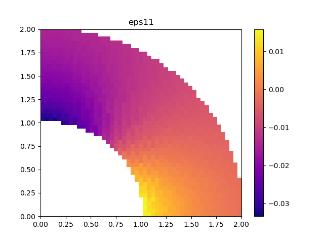
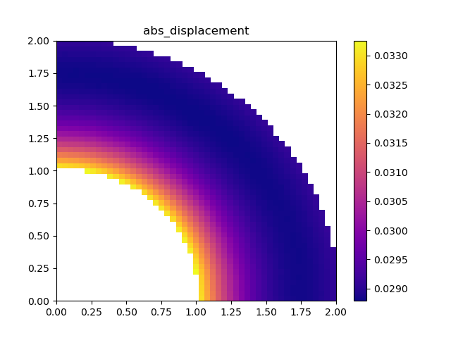

# Описание проекта
Параллельная реализация метода конечных элементов на Python, написанная в рамках практикума по программированию во время обучения на мехмате МГУ.


# Решаемая задача

Имеется труба, к внутренней поверхности трубы приложено давление P1, к внешней поверхности трубы приложено давление P2. Заданы упругие констаны материала, из которого сделана труба, Lambda и Mu. Построена конечноэлементная сетка участка трубы. Найти перемещения и деформации в каждой точке сетки.


# Пример вывода программы
```
Geometry configuration took 0.12s
Parallel global stiffness construction took 4.68s
Right hand side assembly took 0.01s
Fixating conditions application took 0.05s
System solution with spsolve took 0.01s
Parallel calculation of strains and stresses took 2.3s
Total parallel took 7.17s
```


